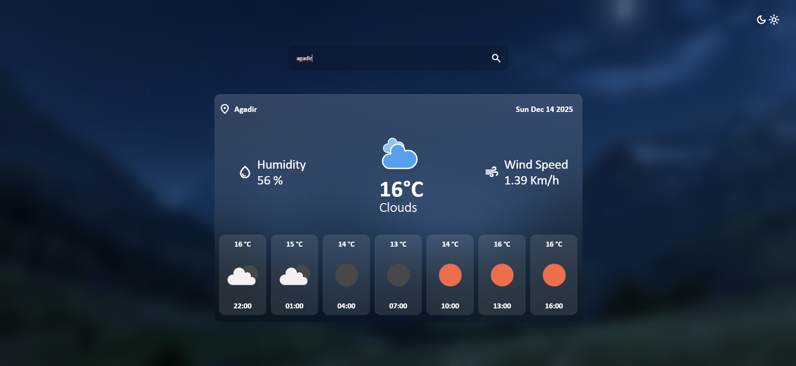
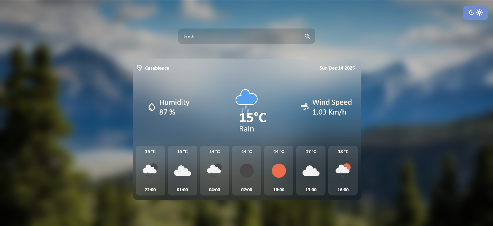

  

****

  

# 🌦️ **Weather App Project**
---

##   **Project Overview**

This project is a modern Weather web Application that allows users to search for any city and get real-time weather information.

It fetches live data from the OpenWeatherMap API and displays current weather conditions, temperature, wind speed, humidity, and a short-term forecast.

The app also includes a light and dark mode toggle for better user experience.

---

##  **Features**

* Search weather by city name  
* Real-time weather data from API  
* Dynamic weather icons based on conditions  
* Wind speed and humidity display  
* Forecast section  
* Light & Dark mode toggle  
* Error handling for invalid cities  

---

##  **Technologies Used**

* HTML5
* CSS3
* JavaScript (DOM manipulation & Fetch API)
* OpenWeatherMap API
* Material Symbols Icons

                                                   Don't forget to starred this repository ⭐        

